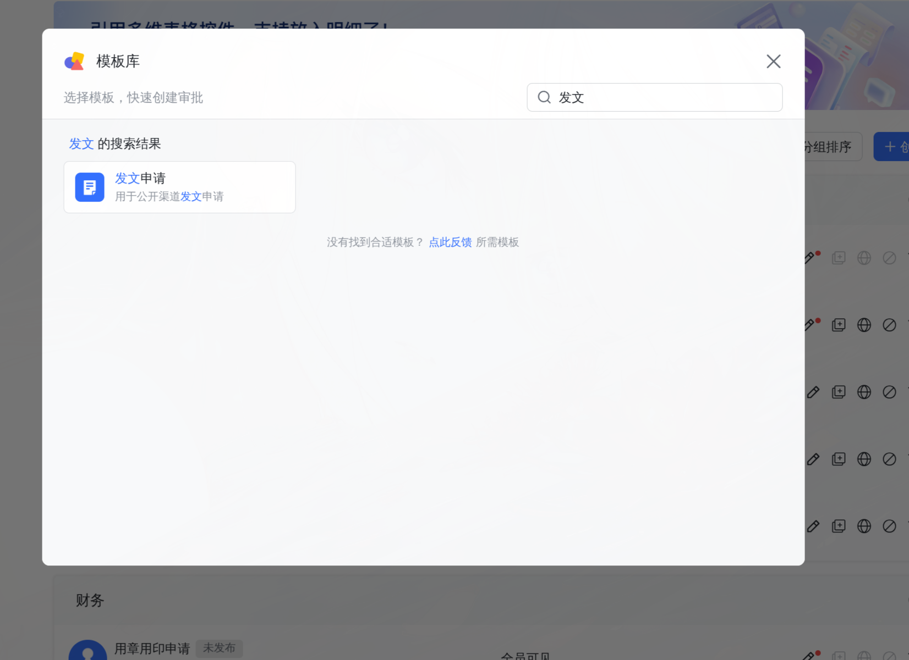
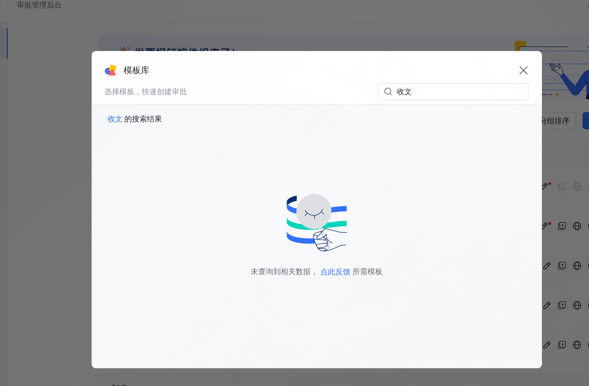
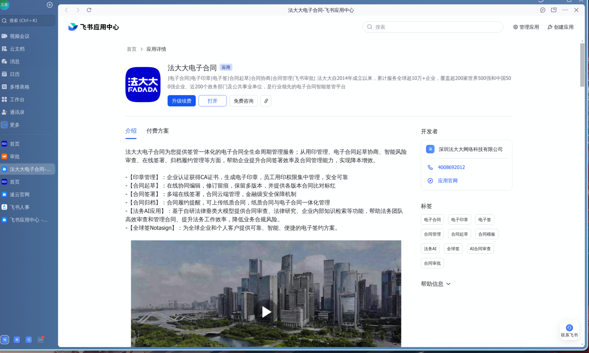
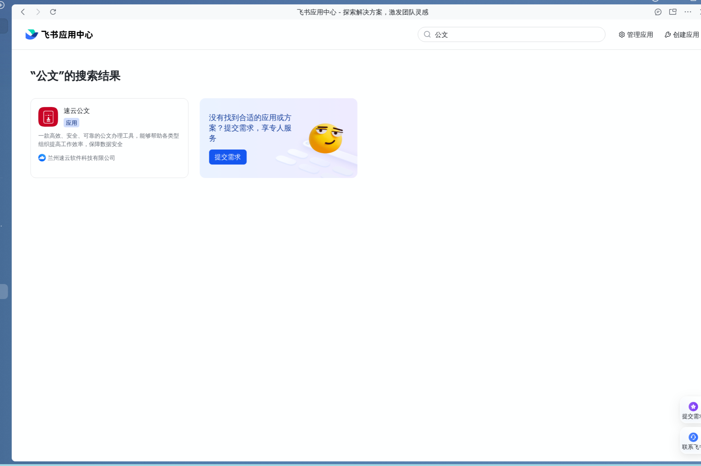

# 讲解报告

现在的审批任务，就是那么几个模块的内容

第一个模块是“人力模块”，就是包括“假勤”，“人员调动”，“人员离职”之类的审批

这个可以用飞书自带的[“飞书people”](https://www.feishu.cn/hc/zh-CN/articles/536403642699-%E4%B8%80%E6%96%87%E8%AF%BB%E6%87%82%E9%A3%9E%E4%B9%A6people)这个应用。

该应用的功能包括：

1. 招聘

2. 绩效

3. 飞书人事（这另外一个应用）

    1. 花名册，人员管理

    2. 人员档案之类的

    3. 假勤，绩效之类的

这只是这个飞书people的通用功能（人力方面的），人力方面接审批的话，也可以通过飞书本身就是高度集成的来实现

第二个模块是“公文模块”

要么就是用飞书的审批里面的模板，有发文模板

暂时没有，可能需要自己开发

或者是用飞书应用商店的第三方服务：

第三个模块就是“用印模块”

也就是法大大这个程序的集成。

首先，法大大本身在飞书的应用商店有应用

其次，法大大官网写了如何集成到飞书“审批”里面。

[法大大介绍](https://www.fadada.com/article/feishudianziqian)

第四个模块是“财务模块”

这个东西我不知道具体是什么，然后应该怎么研究，不过我翻看了飞书的应用商城“财务”

看起来开发难度不高，应该可以自行开发。

不像公文这块 存在技术壁垒，目前飞书只有
这一款应用，而且不支持集成到飞书的审批流程中，所以比较麻烦。

至于飞书的审批流程。关键节点，流程本质上就是画“流程图”就是把原来的量子系统的流程图搬到飞书就行，而原来量子系统的流程图和飞书的流程虽然有点不一样，但大部分功能都有。